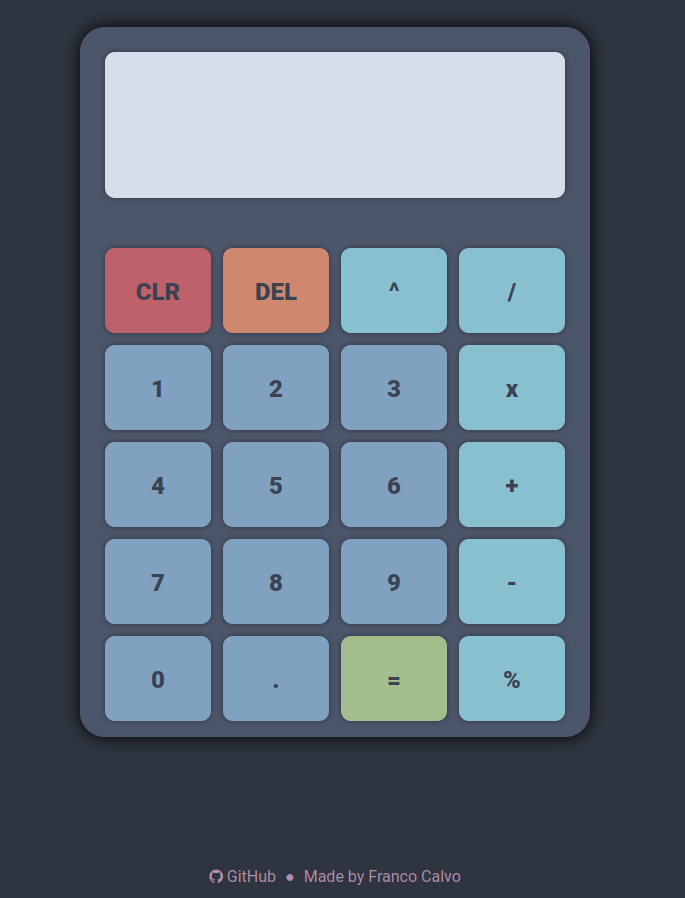

# Simple calculator

This is a simple project for a Calculator developed as homework for The Odin
Project's Foundations course.

The colorscheme is [Nord](https://www.nordtheme.com/).
A live demo is here: [DEMO](https://francocalvo.github.io/odin-calculator/).

## Missing:

- [ ] Add keyboard functionality.
- [ ] Make it adaptive and mobile-compatible.

**Preview:**

